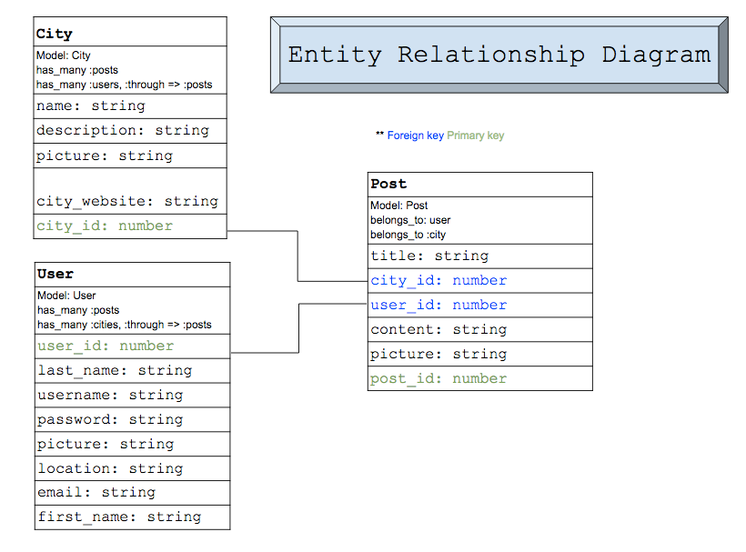
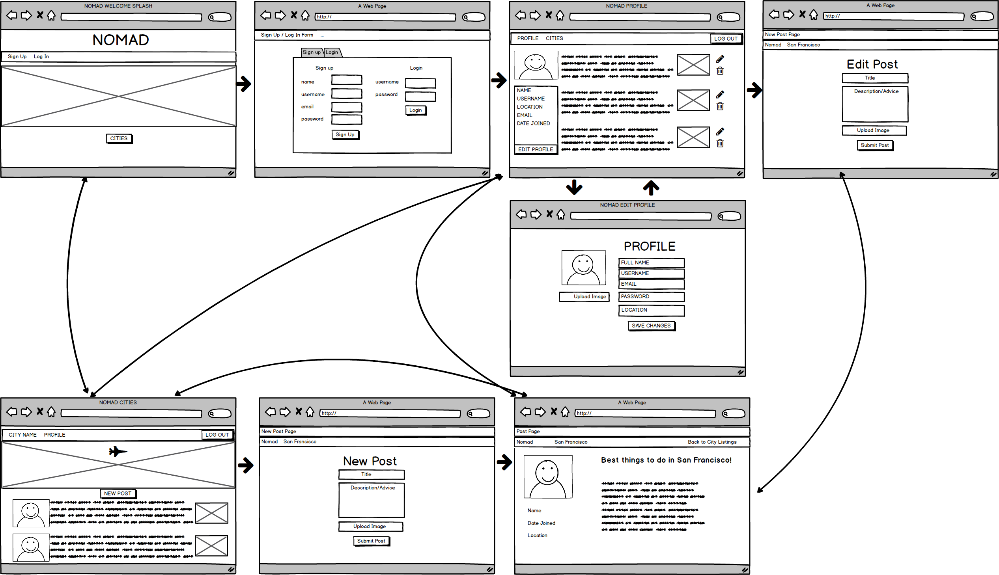

# Nomad

Nomad is a crowdsourced travel community app that allows users to create and edit an account and write and edit posts about locations within the city of their choice.

[Link to Nomad](https://nomad30.herokuapp.com/)

## Entity Relationship Diagram

## Wireframe

## Technologies used

Nomad implements the following technologies:
+ Ruby on Rails
+ PostgreSQL
+ Sass
+ Materialize
+ HTML
+ bcrypt

## Current features

Users can:
+ Sign up and Login
+ View cities
+ Logged in users can write, edit, and delete their own posts about cities

## Planned features

+ Users will be able to comment on individual posts
+ Admin privileges
+ Users will receive an account confirmation email when they sign up
+ Paperclip or Amazon services for direct image uploading

## Project group members

+ [Sophia Nakpil](https://github.com/sophn11/)
+ [James de la Cruz](https://github.com/jamesdlc/)
+ [David Kim](https://github.com/WDIDavidKim/)
+ [Paolo Sese](https://github.com/jpaolosese/)
